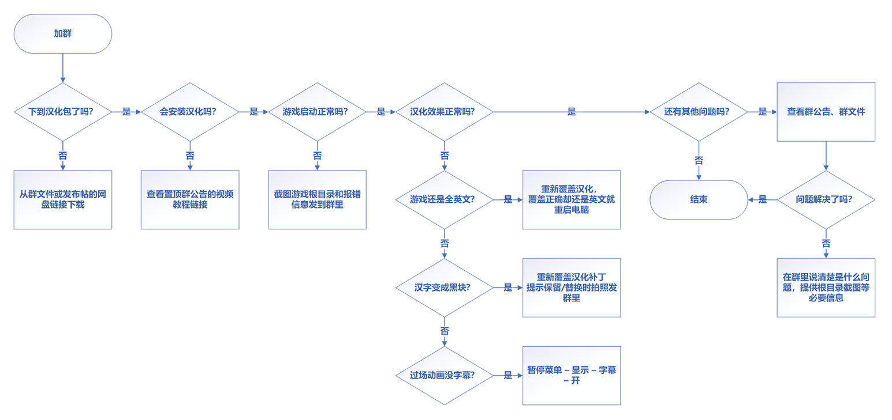

> **最后更新日期：2023 年 7 月 4 日 18:20:51**

## 前言

> 2016 年年底，GTA4 进行了一次更新，原有汉化补丁全部失效，随后无名汉化组立项四代汉化。

> 2019 年，无名汉化组因种种原因停工，贴吧吧友接棒，最终在三年之后完工，期间 Steam 上的 GTA4 也和单独发售的自由城之章合并为了完整版。

> 今天，**本体、TLAD、TBoGT 三个部分以及游戏中的网页文本全部汉化完成**，程序几经优化，译文再三润饰，新的汉化补丁终于和大家见面了。

## 下载

:::danger 下载需知：

**碰到游戏本身的人物拖影、高帧车辆打滑、被关车库、上不去载具等 BUG 时，莫赖汉化，自行查看此文档 👉[《GTA4游戏bug全解》](../docs/GTA4%E6%B8%B8%E6%88%8F%E7%9B%B8%E5%85%B3%E9%97%AE%E9%A2%98%EF%BC%88%E6%97%A0%E5%85%B3%E6%B1%89%E5%8C%96%E8%A1%A5%E4%B8%81%EF%BC%89/1%EF%BC%9A%E6%B8%B8%E6%88%8F%E7%9B%B8%E5%85%B3%E9%97%AE%E9%A2%98.md)，并根据需要安装[FusionFix 错误修复补丁](https://wwi.lanzoup.com/b07xe74sj)来锁定游戏帧数上限至 30 并修复游戏一些常现问题。**下方前两个直链提供的文件均为 10mb 左右的原版，从人性化的角度推荐进入赠品镜像中下载安装「GTA4 汉化补丁 2023-07-04(包含 FusionFix)」。

2023 年 7 月 4 日程序更新修复所有已知 bug。文本较旧版无改动，<del>如无意外</del>此版本即为最终版。下方同时提供 .zip 和 .exe 的汉化包，内容完全相同。若您不了解「压缩」，请下载 .exe 版本。

:::

- [👉 立即下载 .exe 最终版汉化补丁](https://link.jscdn.cn/1drv/aHR0cHM6Ly8xZHJ2Lm1zL3UvcyFBczVoZ0w4dTlPMzFpRmtuY2FEM21ZbFk1bUYwP2U9dTc5cVpt.exe)

- [👉 立即下载 .zip 最终版汉化补丁](https://link.jscdn.cn/1drv/aHR0cHM6Ly8xZHJ2Lm1zL3UvcyFBczVoZ0w4dTlPMzFpRnZfLVVKendPX3hZUklSP2U9Y0V3RFdw.zip) 　　 [ 👉 全系统安装汉化教程 ](./安装汉化/0：安装前准备.md)
> 一旦下载失败则不要犹豫立即使用下方的备用下载。

- [[备用下载]&&[赠品]：蓝奏云](https://wwi.lanzoup.com/b07xe74sj)

- [[备用下载]&&[赠品]：百度云](https://pan.baidu.com/share/init?surl=lYiAaFVzQGpJD79Fx56ZZw&pwd=1234)

- [汉化问题反馈收集表 - 腾讯文档](https://docs.qq.com/form/page/DQXdCd1BwT1VrbXV5)

- [汉化文本&&程序源码](https://github.com/GTAIV-Complete-Edition-text)，本汉化 MOD 为开源项目。欢迎向我们提[lssues](https://github.com/GTAIV-Complete-Edition-text/feedback-IV.CHS/issues)以改进。

- 感谢烏鴉(ozzysunn)为汉化程序制作两个压缩包

## 📱 汉化客服群：

- [赠品文档 👉 《GTA4游戏bug全解》](./GTA4%E6%B8%B8%E6%88%8F%E7%9B%B8%E5%85%B3%E9%97%AE%E9%A2%98%EF%BC%88%E6%97%A0%E5%85%B3%E6%B1%89%E5%8C%96%E8%A1%A5%E4%B8%81%EF%BC%89/1%EF%BC%9A%E6%B8%B8%E6%88%8F%E7%9B%B8%E5%85%B3%E9%97%AE%E9%A2%98.md)

管理员仅接受本站所列情况之外的求助，如果轻易进群并提出本站/群公告&群文件所列情况之内的问题，<del>势必</del>可能会遭到嘴臭/禁言等攻击性较强的侮辱。讨论则不拒绝。

下方提供了自助解决 BUG 流程图，如果不想被嘴臭可以把加群相关步骤改为彻底阅读本站文档。
**人数较多，警惕电信诈骗。**

import Click from '@site/src/components/click';

<Click />

由于图片不支持**点击查看大图**，可在浏览器新标签页中**查看大图**

<!-- ## 🐞 问题说明

2023 年：

> 7 月 4 日（0704）汉化：

- 修复了所有程序上已知的问题，**汉化现在不会出现任何影响游戏运行的 bug**。
- _如何更换汉化版本：直接覆盖文件。_
- _如何关闭汉化：删除 plugins/GTA4.CHS.asi_

2022 年：

> 9 月 29 日（0929）汉化：

- 文本更新。
- 解决了**「字幕黑块」**问题。
- 自 2023 年 4 月起不再提供 png 图片字库版汉化下载。此版字库曾导致调整分辨率时出现 DD3D80 错误弹窗。

> 6 月 14 日（0614）汉化：

- 偶有漏译和错译。
- **「字幕黑块问题说明」**：无法在 RGL（R 星自家游戏平台）上正常使用。安装汉化文件后，游戏本身的文件会被替换，这会使游戏无法通过 RGL 平台启动时的「验证游戏完整性」机制，导致游戏文件被 RGL 还原至汉化前。非 RGL，如 steam、EPIC、GOG 等平台，虽然没有这种**每次启动游戏时对游戏文件进行验证的严格机制**，但若偶遇 RGL 更新，依然会触发「验证游戏完整性」机制。**需要通过重新手动安装 1 次汉化来使其正常运行。**<del>看到了吧，千万不要买首发于 RGL 的 GTA6 否则不能打 MOD。</del>
- 在部分电脑上游玩 TBOGT 会出现如下概率性极小、极难出现，且汉化组成员无一稳定复现的 BUG：读档后所有文字全部消失，需要重新进入游戏才能解决。目前尚未发现造成此 bug 的原因。如果有好心人愿意帮助我们稳定复现汉化 bug，请加群。

> **_切屏后黑屏、画面一卡一顿、过场动画闪烁、进车库被关出不来、终章上不去载具等问题_**是游戏本身的 bug，与汉化无关。下方文档提供了解决办法。 -->

##

[友情链接：百度贴吧—GTA4 吧（欢迎发帖讨论游戏与汉化）](https://tieba.baidu.com/f?kw=gta4&ie=utf-8)

感谢[百度搜索](https://www.baidu.com/s?ie=UTF-8&wd=b9348.gitee.io)收录本站，可通过百度搜索如下关键词找到本站：[b9348.gitee.io](https://www.baidu.com/s?ie=UTF-8&wd=b9348.gitee.io)

感谢[Gitee 码云](https://gitee.com/)提供的免费的 Gitee Pages 网站服务

**关于转载：**首先感谢各位捧场转载并用自身的流量发布此模组。 
但是！请各位转载时不要直接转载走汉化文件，请仅提供此页或赠品页作为下载链接。此举用以防止哪一天我们突然找到了某个新的bug或者是翻译文本进行更新时，旧版汉化仍在流传，从而导致各种意料之外的bug出现并得不到及时解决。
