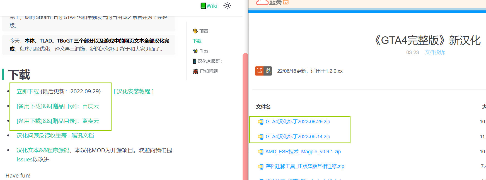

# 0：安装前准备

- _如何更换汉化版本：直接覆盖文件。_
- _如何关闭汉化：删除 plugins/GTA4.CHS.asi_
## 0.5 正版游戏自动安装
>以下为自动汉化补丁专属安装教程👇；感谢烏鴉(ozzysunn)录制视频：

<video src='https://link.jscdn.cn/1drv/aHR0cHM6Ly8xZHJ2Lm1zL3YvcyFBczVoZ0w4dTlPMzFpRUZ5aFh3X04zdzVic1ZYP2U9a29ZeURW.mp4'
controls="controls" width='100%'>
</video>

1. 运行一次原版游戏，确定游戏能够正常运行。 
*如果曾为Steam版安装过降级汉化或是其他需要降级的Mod，请进入游戏根目录删除所有文件，验证完整性重下游戏。避免降级汉化引入的多余文件影响正常游戏。*
1. 将汉化包解压。
2. 双击运行解压后的`正版游戏自动安装(先至少运行一次游戏).bat`，提示`完成！`后关闭该窗口。

*！若无法自动安装或安装失败，请打开汉化包中的「release」文件夹，将里面的所有文件和文件夹复制粘贴到游戏根目录 (GTAIV.exe所在文件夹)。*

4. 启动游戏，在**选项 - 显示**中将**字幕**设置为**开**。 

> 如果你能理解[全选 — 复制 — 粘贴到根目录]这三个步骤，那就不需要看后面了，装汉化就一句话：

> “找到汉化包里的dinput8.dll文件，把该文件所在路径下的所有文件和文件夹复制粘贴到游戏目录。（GTAIV.exe所在文件夹）”

> 下面的图文都是特地给不会玩电脑的人看的。

## <input type='checkbox' /> 1. 解压缩
> 以下为手动解压教程👇

<video src='https://link.jscdn.cn/1drv/aHR0cHM6Ly8xZHJ2Lm1zL3YvcyFBczVoZ0w4dTlPMzFpRF8wWEd2RVRUTjZISFg5P2U9bGhaRlIx.mp4'
controls="controls" width='100%'>
</video>

请先确认电脑拥有解压文件的能力。使用Windows 7及以上系统时，自带对.zip压缩文件的处理能力。但此教程仍推荐你使用[第三方解压缩软件](https://www.bandisoft.com/bandizip/)。

## <input type='checkbox' /> 2. 最新的《GTA4完整版》 
无论是在Steam、RGL购买或是网络下载得来的学习版，都必须保持游戏版本号在1.2.0.xx之上

查看版本号的方式：

> **拒绝任何升级得来的游戏，必须全新下载**

## <input type='checkbox' /> 3. 汉化补丁
电脑上已经存在从本站或其他来源下载的[《GTA4完整版》新汉化补丁](../intro.md#下载)

> **`达成三项后方可继续浏览下一页`**