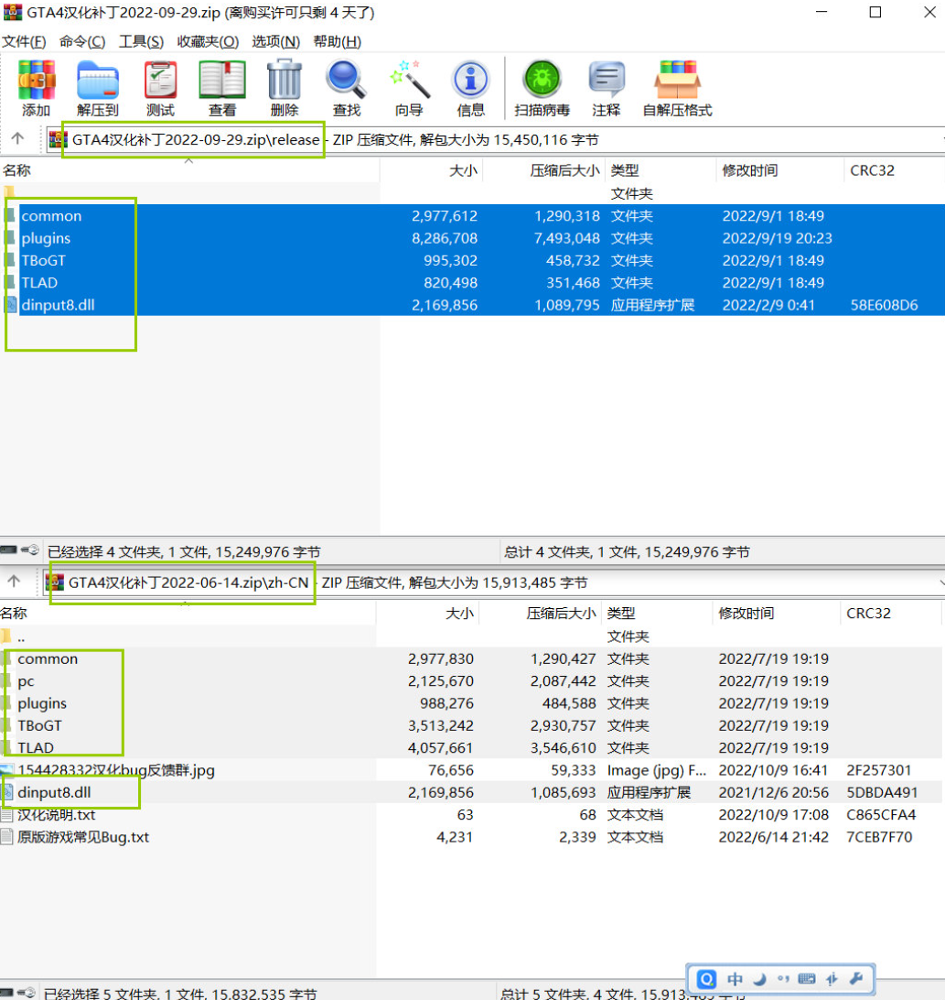
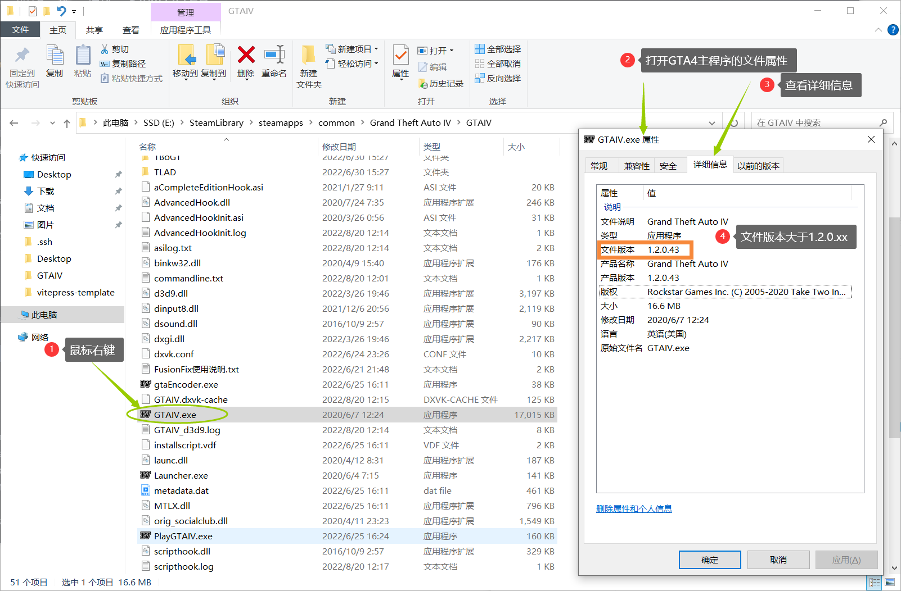
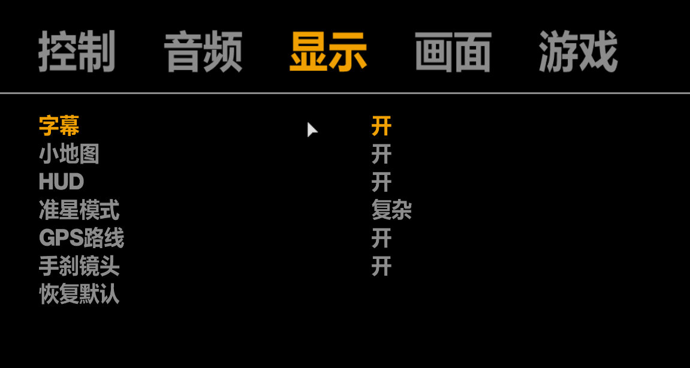

# 1：安装汉化

## <input type='checkbox' /> 1. 复制

汉化补丁只需安装一份（新or旧）。选择任一汉化补丁下载，打开汉化补丁的压缩包，找到`dinput8.dll`文件后，选中当前路径下所有文件。

同时按 <kbd>Ctrl</kbd> + <kbd>C</kbd> 键，复制汉化文件

> **`图片仅供参考，下载到的文件有可能和图片不同。切勿一比一还原对照图片操作。`**
>
> **`图片仅供参考，下载到的文件有可能和图片不同。切勿一比一还原对照图片操作。`**
> 
> **`图片仅供参考，下载到的文件有可能和图片不同。切勿一比一还原对照图片操作。`**

## <input type='checkbox' /> 2. 粘贴 

找到`GTA4游戏目录`，即GTA4主程序所在的文件夹(游戏目录解释：这个文件夹内必须存在该游戏的主程序'GTAIV.exe')

同时按<kbd>Ctrl</kbd> + <kbd>V</kbd>，把刚才复制的汉化补丁粘贴到`GTA4游戏目录`

- 当你安装了旧版0614汉化时，会出现弹窗询问是否替换文件？

- 当你安装了新版0929汉化时，则不会出现。忽略即可。

**恭喜你，只差最后一步了。(如遇弹框询问，无脑选择`替换`即可，其它的啥也别管别问)**

> 当出现上图`这类对话框`时，无脑选择`首选项`。旧版汉化补丁必须替换掉游戏原版文件，所以不管跳出`替换`还是`覆盖`的询问，统统选择换掉文件。新版则不需要替换游戏文件

##  3. 完成

替换完成后，游戏目录**必须存在dinput8.dll**，**没有这个文件，汉化无法生效**。

**`最后一步：启动游戏，在「选项 - 显示」中将「字幕」设置为「开」。`**

至此，教程结束。

 

### 非Windows安装问题

- Steam Deck启动游戏后仍是英文

在启动项中添加 
~~~
WINEDLLOVERRIDES="dinput8.dll=n,b" %command% 
~~~

- OS X系统使用CrossOver运行游戏，启动后仍是英文

将根目录的 `binkw32.dll` 改名 `binkw32Hooked.dll`。
再将汉化补丁附带的 `dinput8.dll` 改名 `binkw32.dll`。

Wine类的运行方式应该都可以这样解决，Steam Deck估计也可以。

#### 附加：视频教程

觉得文字描述太抽象的，这里有视频教程：[https://www.bilibili.com/video/BV12r4y1i721](https://www.bilibili.com/video/BV12r4y1i721)

如果觉得有用，请点击下方☺表情点个赞吧:)